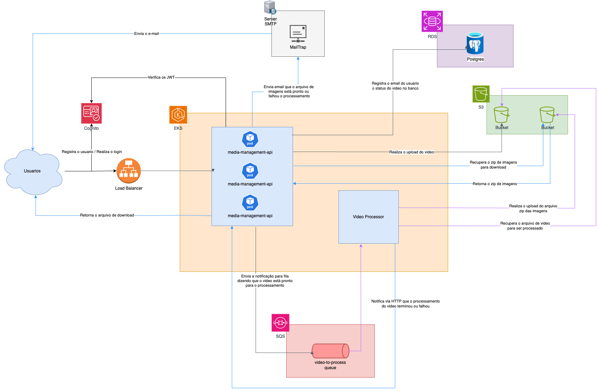

# Media Management API
_____________________
Microserviço responsável por gerenciar os arquivos de mídia do sistema. Onde ela é responsavel
pelo envio dos videos no S3 da AWS, gerencia o status de processamento do video.

# Funcionalidades
___________________
- Recebe o video do usuario
- Realiza o upload do video para S3 na AWS
- Notifica o serviço Video Processor
- Atualiza o status do video
- Permite o download do arquivo zip das imagens do video

# Stack
_____________________
- .NET 8.0
- SQS
- S3
- NUnit
- Moq
- Entity Framework
- Postgresql
- Cognito
- SMTP Server

# Arquitetura
_____________________
O serviço de media management recebe o arquivo de vídeo do usuário para upload. Durante esse processo, o vídeo é enviado para o S3 da AWS, e o serviço de media management notifica o serviço de video processor por meio de uma mensagem na fila SQS da AWS, solicitando o processamento do arquivo. Após o processamento, o serviço de video processor envia uma notificação via HTTP ao serviço de media management para atualizar o status do vídeo. Em seguida, o serviço de media management atualiza o status e envia um e-mail ao usuário informando que o arquivo de imagens está pronto para download. Quando o usuário solicita o download, o serviço de media management recupera o arquivo do bucket S3 e realiza o download.

Os endpoints utilizados pelo usuário do serviço de media management são protegidos por usuário e senha e utilizam o cognito para cadastramento dos usuários, geração de tokens JWT e validação de autenticação. As informações dos usuários são recuperadas no cognito utilizando o token JWT do usuário logado, e cada usuário só pode visualizar os arquivos que ele mesmo gerou. Já os endpoints que não fazem parte do fluxo de usuário como, por exemplo, o de atualização de status, são protegidos por um schema de autenticação de aplicação para aplicação, utilizando Api Key.



# Como executar o projeto
_____________________
Por depender de alguns serviços da AWS, o setup necessita de uma conta com alguns recursos para utilização.

## Pré-requisitos
- Docker
- Buckets S3 para armazenamento de vídeos e arquivos ZIP
- Conta AWS com permissão para criação e consumo de filas no SQS

1. Na raiz do projeto, execute o comando
```bash
   docker compose up
```

[Postman com endpoints](./docs/98videos.postman_collection.json)


# Tests
Para executar os testes da aplicação, basta rodar o comando abaixo na raiz do projeto:

```bash 
  dotnet test
```